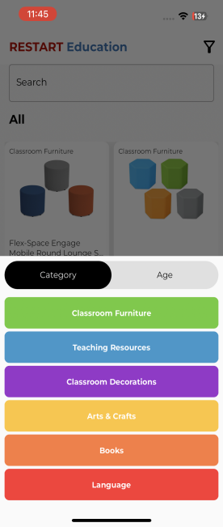
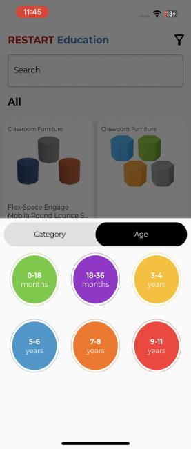
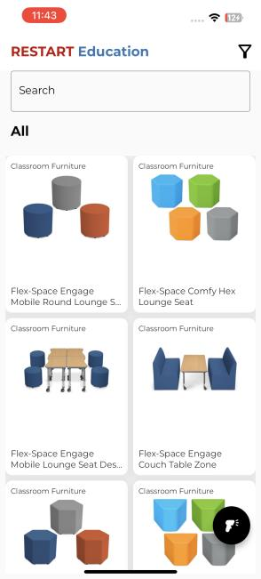
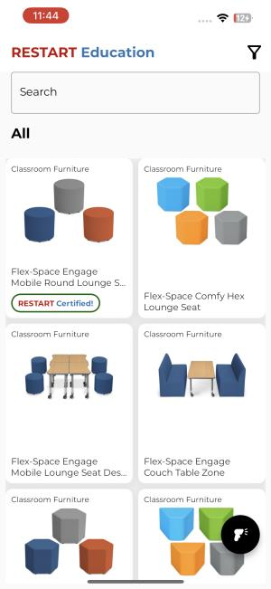
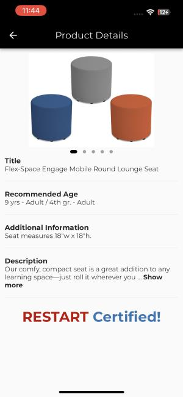

Restart Educational Foundation

> 1\. Products:
>
> • Onthelanding screen,allproductswillbeshown.
>
> • Users and searchfor anyproductfromthesearchbar atthetop.
>
> • Users canalsofilter productsonthebaseofageand
> categoriesfromthefilter button atthetop rightcorner.
>
> • Ontapping anyproductuser canseeproductdetails.
>
> 2\. Scanning Productsintosystem:
>
> • Toscanproducts,searchproducts. • Gotoitsdetailsscreen.
>
> • Pressthe**ScanBarcode**button. • Itwillopenabar codescanner.
>
> • Scanproduct,itwilladdthisbar codeagainstthisproductinour system.
>
> • After adding barcodeintoour system.TherewillbeRestartCertified
> tagswiththis Product.

> 3\. SearchaProductthroughBarcode
>
> • Onceaproductwillbeadded tothesystem.
>
> • Userscanverifythisproductthroughbarcode.
>
> • Pressthescanner buttonatthebottomright,itwillopenabarcodescanning
> camera.
>
> • Scantheproduct,ifitemexistsinsystem,itwilltakeyoutoproductdetails
> screen.
>
> • Otherwise,itwillshowproductsnotfound.

